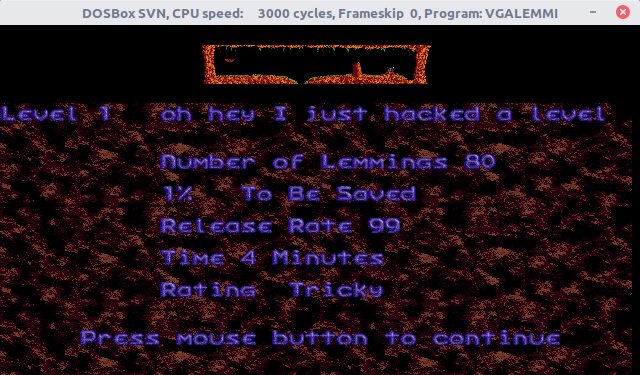

Getting Started
===============

Requirements
------------

Mr. Crowbar is written in Python 3. (Unfortunately Python 2 is not supported, as there are too many quirks in the type system)

You can install the latest point release of the library from the Python Package Index:

.. code:: bash

   pip3 install mrcrowbar

For development, you can check out the latest source tree, `create a virtualenv for Python 3 <http://docs.python-guide.org/en/latest/dev/virtualenvs/>`_, and load it in as a package:

.. code:: bash
   
    git clone https://github.com/moralrecordings/mrcrowbar
    cd mrcrowbar
    virtualenv -p /usr/bin/python3 venv
    source venv/bin/activate
    pip install -r requirements.txt
    pip install -e .
    pip install ipython     # for a nicer Python shell with autocomplete

Windows 10 users: I highly recommend installing the `Windows Subsystem for Linux <https://docs.microsoft.com/en-us/windows/wsl/install-win10>`_ and using Ubuntu's bundled Python installation, instead of the native Win32 console edition.

[This chunk of the docs needs a lot of work. If you are struggling, please hit me up via `email <mailto:code@moral.net.au>`_ or on Twitter at `@moralrecordings <https://twitter.com/moralrecordings>`_.]

Writing and using Blocks
------------------------

Here's a class for a level file used by the 1991 DOS game *Lemmings*, taken from mrcrowbar.lib.games.lemmings:

.. code:: python

    from mrcrowbar import models as mrc

    class Level( mrc.Block ):
        """Represents a single Lemmings level."""

        #: Minimum Lemming release-rate.
        release_rate =      mrc.UInt16_BE( 0x0000, range=range( 0, 251 ) )
        #: Number of Lemmings released.
        num_released =      mrc.UInt16_BE( 0x0002, range=range( 0, 115 ) )
        #: Number of Lemmings required to be saved.
        num_to_save =       mrc.UInt16_BE( 0x0004, range=range( 0, 115 ) )
        #: Time limit for the level (minutes).
        time_limit_mins =   mrc.UInt16_BE( 0x0006, range=range( 0, 256 ) )
        #: Number of skills.
        num_climbers =      mrc.UInt16_BE( 0x0008, range=range( 0, 251 ) )
        num_floaters =      mrc.UInt16_BE( 0x000a, range=range( 0, 251 ) )
        num_bombers =       mrc.UInt16_BE( 0x000c, range=range( 0, 251 ) )
        num_blockers =      mrc.UInt16_BE( 0x000e, range=range( 0, 251 ) )
        num_builders =      mrc.UInt16_BE( 0x0010, range=range( 0, 251 ) )
        num_bashers =       mrc.UInt16_BE( 0x0012, range=range( 0, 251 ) )
        num_miners =        mrc.UInt16_BE( 0x0014, range=range( 0, 251 ) )
        num_diggers =       mrc.UInt16_BE( 0x0016, range=range( 0, 251 ) )
        #: Raw value for the start x position of the camera.
        camera_x_raw =      mrc.UInt16_BE( 0x0018, range=range( 0, 1265 ) )
        
        #: Index denoting which graphical Style to use.
        style_index =       mrc.UInt16_BE( 0x001a )
        #: Index denoting which Special graphic to use (optional).
        custom_index =      mrc.UInt16_BE( 0x001c )

        #: List of Interactive object references (32 slots).
        interactives =      mrc.BlockField( Interactive, 0x0020, count=32, fill=b'\x00' )
        #: List of Terrain object references (400 slots).
        terrains =          mrc.BlockField( Terrain, 0x0120, count=400, fill=b'\xff' )
        #: List of SteelArea object references (32 slots).
        steel_areas =       mrc.BlockField( SteelArea, 0x0760, count=32, fill=b'\x00' )
        #: Name of the level (ASCII string).
        name =              mrc.Bytes( 0x07e0, 32, default=b'                                ' )

        @property
        def camera_x( self ):
            """Start x position of the camera."""
            return self.camera_x_raw - (self.camera_x_raw % 8)

        @property
        def repr( self ):
            return self.name.strip().decode( 'utf8' )

Binary layouts in Mr. Crowbar are called blocks. To open a binary format, you can create a Python class inheriting from ``Block``, with a number of ``Field`` objects as class variables. Fields are rules for how to interpret bytes in a block. At any time, you can construct a new ``Block`` object from a raw byte string, or generate the byte string equivalent of an existing ``Block`` object.

In the Lemmings level format, all of the numeric variables (e.g. release rate, number of each skill) are stored at the start of the file as unsigned 16-bit big-endian integers. To read these, the ``Level`` class defines a number of ``UInt16_BE`` field objects at the class level. Each ``UInt16_BE`` is created with a (block relative) offset to read data from, and occasionally a ``range`` parameter which constrains it to a list of allowable values. (Adding a ``range`` is an example of an extra validation rule you can add to a field.)

Mr. Crowbar offers fields for all of the common primitive types. There are also special fields that extend the primitives; an example is ``Bits``, which lets you create multiple variables from masked-off bits in the same byte.

Finally, there is the option to load other ``Block`` classes from inside a parent block; ``interactives``, ``terrains`` and ``steel_areas`` are defined using ``BlockField``, which produces lists of ``Interactive``, ``Terrain`` and ``SteelArea`` blocks respectively.

As blocks are Python classes, it is trivial to extend them with custom code; here we've created a ``camera_x`` property which provides a transformed view of ``camera_x_raw`` taking into account the limitations of the game engine. This is useful for e.g. bitpacked values that need mathematical transformation to get the useful real-world equivalent.

The above code is enough to create a two-way binding model for a Lemmings level. With some additional models and a Loader, it becomes possible to edit and write back parts of the game data. Here's an example for Lemmings; this will modify your game, so be sure to do this on a copy!

.. code:: python

    from mrcrowbar.lib.games import lemmings
    from mrcrowbar import utils

    # auto-load all the files
    ll = lemmings.Loader()
    ll.load( '/path/to/copy/of/lemmings' )

    # pick the first level of Tricky
    level = ll['./Level000.dat'].levels[0]   # <Level: This should be a doddle!>

    # Level is a block type, which means we can peek at the bytes representation at any time
    bytes_orig = level.export_data()
    print( 'Original level data:' )
    utils.hexdump( bytes_orig )

    # change some stuff around!
    level.release_rate = 99
    level.num_to_save = 1
    level.name = b'  oh hey I just hacked a level  '

    # now that the block has changed, the bytes will be different
    bytes_new = level.export_data()
    print( 'Changes:' )
    utils.hexdump_diff( bytes_orig, bytes_new )

    # finally, get the loader to save our changes back to the original file
    ll.save_file( './Level000.dat' )

When we open up Lemmings and change the difficulty to "Tricky", we can see the changes. 

